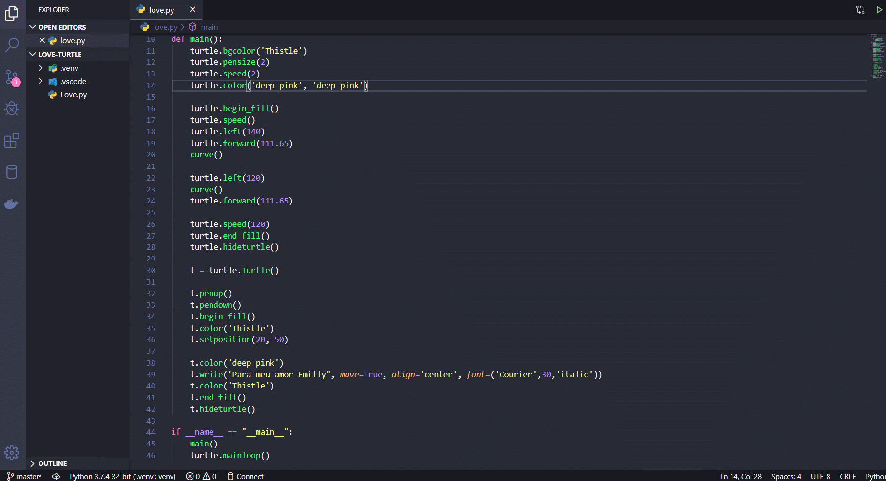

# Love Code

<p align="center">
    
</p>

Uma declaração para minha namorada usando #python

### Pré-requisitos

Instale todas as dependências do requirements.txt com PIP

### Instalação

Crie um virtual env para empacotar suas libs Python

```
python -m venv .venv
```

Ative sua virtual env

```
source .venv/bin/active
```

Use o PIP, gerenciador de pacotes do Python para instalar todos os requisitos

```
pip install -r requirements.txt
```

Execute o programa

```
python Love.py
```

## Authors

* **David Lucas** - *Site* - [david-luk4s](https://david-luk4s.github.io/)
